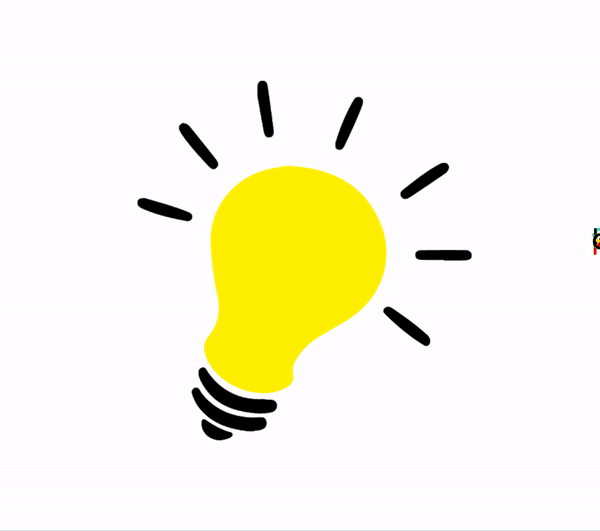

<!-- # p5-template

Use this template for a brand new p5.js project. 


# Assignment 1: Make a brush

1.  Find an object, texture, or motion that you want to recreate using p5.js Here is [some inspiration](https://lmccart.github.io/p5-workshop/). 
2.  Generate some sort of "mark" every time your mouse location changes (aka make a “brush” you can "draw" with using the mouse). 
3.  Include one element that changes as you move the mouse that is *not* just the location of the mark. This could be scale, color, angle, or more. 
4.  (Optional) Include one element that is different each time you load the sketch (you may want to use randomness!)


## Some helpful questions to think through

#### Q: What ideas do I want to convey with my brush? 

You may want to choose an emotion: surprise, playfulness, confusion, etc. 

#### Q: How can I create layers in p5?

Layers can help create a sense of complexity! To do so, comment out the `background()` function in your `draw()` function. This will prevent the screen from being covered by the background color each frame. 

#### Q: How can I create a gradient of colors? 

You might to check out https://p5js.org/reference/#/p5/lerpColor. Also useful: https://p5js.org/reference/#/p5/map

#### Q: Is my brush a tool for the user to create art, or is the brush a work of art in itself? 
 
🤯

#### Q: Are there any resources I can turn to? 

Check out Dan Schiffman's youtube tutorials [http://learningprocessing.com/videos/3-2# ](here)!


This is adapted from [Camille Utterback's class "Drawing with Code"](http://camilleutterback.com/).
 -->
 
 <!-- # Assignment 2: Make a reverse-engineered Snap Lens

Here are the requirements: 

1. VARIABLES: Activate at least one change in p5.js (display an image,run an animation,change the screen in some way, etc.) based on a poseNet keypoint position (this is an object with a x and y property).
2. EVENTS: Activate at least one change in p5.js based on an event (if you raise your hand, or if you make a certain gesture, etc.). 

## Here are the templates in this repo that you can use!

1. 
2. 
3. 
4. 

## Here are templates and resources you can find elsewhere.
1. 
2.  -->

# P5.js Brush

## Description

A simple brush that shows a lightbulb image where you can move your cursor around it and see different words being drawn with movement. All this has been done with the help of a JavaScript library called p5.js.

## Screenshot

<!--  -->
<p align="center">
  
</p>

## Instructions to run the lens on local server

1. Open this repo with the terminal either through an IDE of choice or the system's terminal 
2. Run the repo through a server. If you do not have a server command already installed globally, run the command: 

```
npm install --global http-server
```

Else, run the following the command if you already have a server installed or after running the command above sucessfully:

```
http-server
```

3. Go to the browser and navigate to: localhost:8080
4. Move the cursor around and you will see different words being written into the interface. Refresh if you want to see a new set of words.

## Tools used

- p5.js
